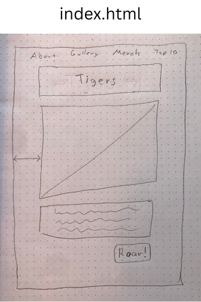
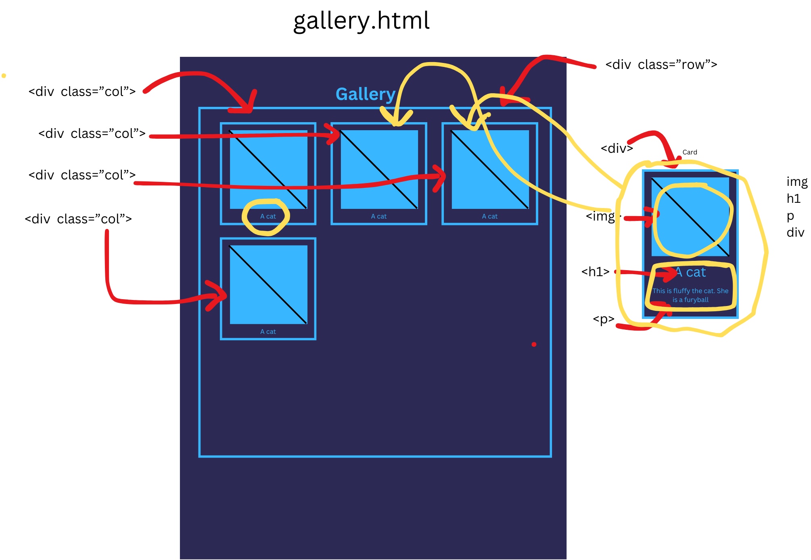

# Capstone Project

## About

Tell about my project. What is it?

## Built with

* A list
* of
* All
* My
* Tech
* Example:
* HTML
* CSS

## Roadmap

- [x] My plan
- [ ] Don't have to be complete.
- [ ] Just the main ideas.
- [ ] Add more as you go.

## Wireframe

An image of your wireframe (Required)

## Contact

Your name and email address

## Acknowledgements

* Any websites
* Any videos
* Any AI
* Any person you work with
* You may use outside help, but you MUST acknowledge it here.
* [w3schools Cards](https://www.w3schools.com/bootstrap5/bootstrap_cards.php)
* [w3schools Navs](https://www.w3schools.com/bootstrap5/bootstrap_navs.php)
* [w3schools For Loops](https://www.w3schools.com/js/js_loop_for.asp)
